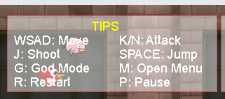
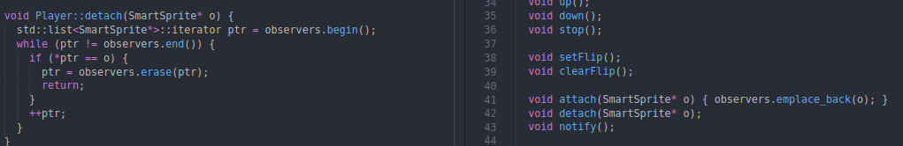
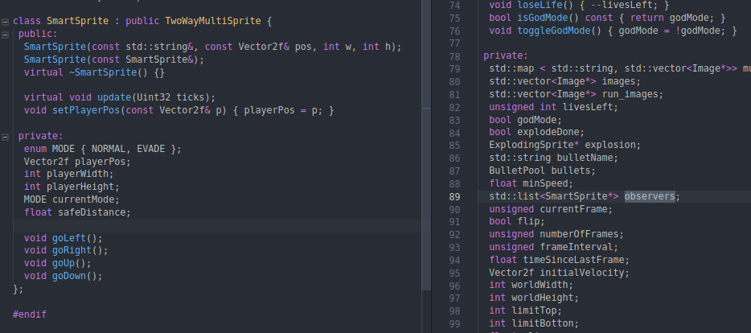
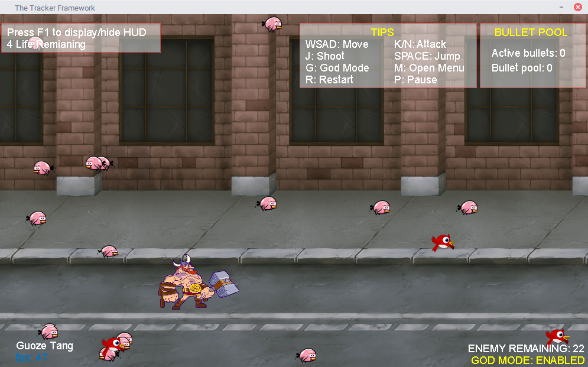
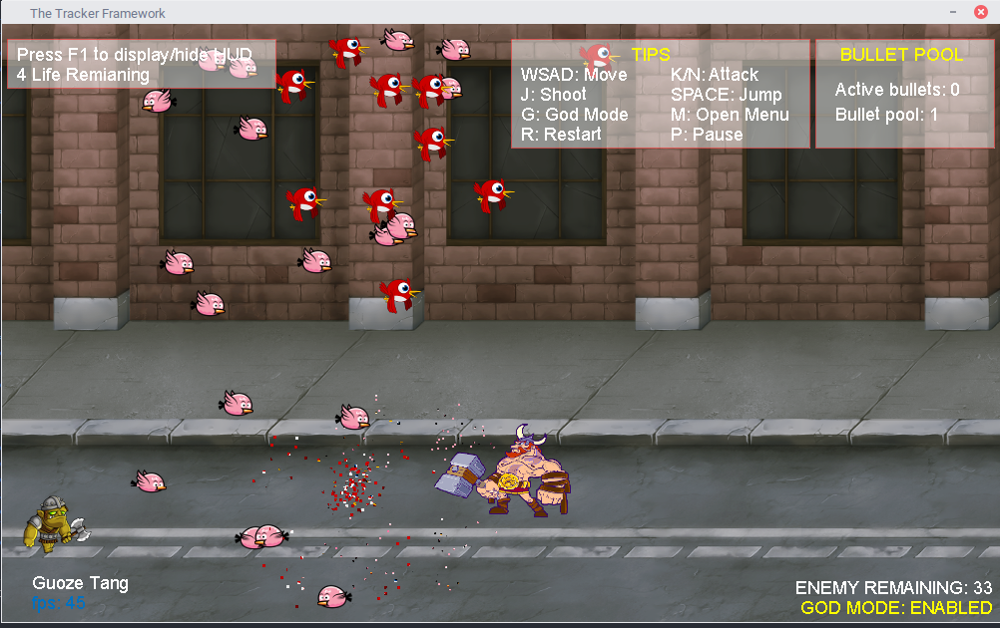
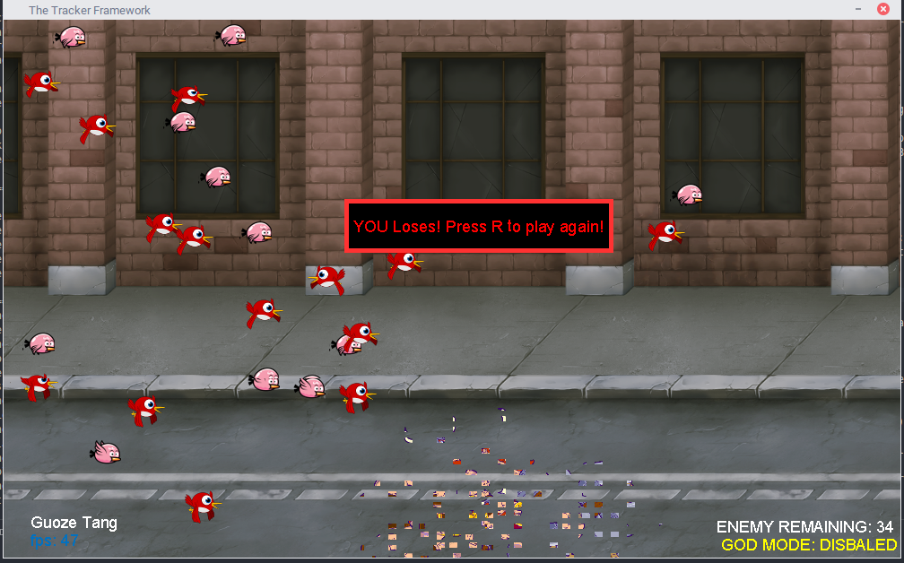
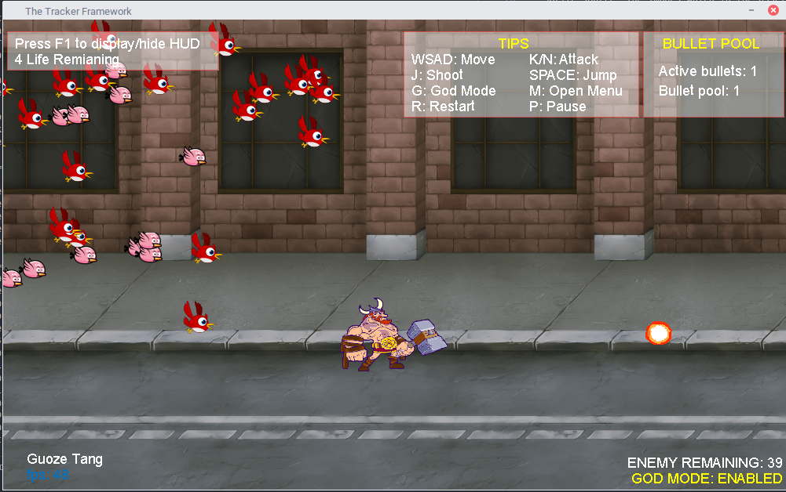

I would like to build a 2D game with the hero game. This game should have these features. (Sprite source: The images which in the asset are all comes from Google image and they all for free.)

* The hero (player) can attack each smart sprite. 
* The smart sprite can attack the hero, and both of them have the attack action. And the smart sprite also needs to avoid the player's attack.
* Keep score: 1.how fast the hero kills all of the smart sprites. 2.how many drops of blood the hero lost in this game.
* Conclude: Use the surplus blood and times to calculate.

# Project introduce

Build a 2-D game engine construction. Use this engine to implement 2D game which has a player object, HUD, collision detection, and explosions features.

* Build a playable game with a player object, HUD, AI, and collision detection.
* Data-Driven: The game must be data driven so that we can read game constants from an XML file.
* Object Pool: Use seven design patterns in this project to build this 2-D game.
* Build HUD with F1 and the HUD should display (1) the fps, and (2) info about how to move the player object.

[Youtubu Video](https://youtu.be/X7uQuaB9wNA)

# Games features

There are two main features in this project. The first thing is the AI and Collision Detection. The other thing is the Pool and Projectiles.

## AI and Collision Detection}

### Build the player

Before we do the AI and collision detection, we need to build the player firstly. I just create the player class inherit from the drawable class. 

I have completed seven actions for the player. These actions include idle, walking, jumping, running, jump attacking, attack1, and attack2. After that, the player can control the player to do these activities in the game.

### AI

I choice the observed pattern to make the smart sprites to avoid the collision with the player. So as the code in the followed, the player to notify smart sprites of its position. After that, the smart sprite can avoid the player when their distance is less than the setting.

So, the smart sprites change the direction if the smart sprites get the notification from the player and calculate their distance between them and player if it less than the set distance. As the picture in the followed. Some pink bird changes the direction before they collide with the player.

### Collision Detection

When the distance between the player and the smart sprite is collied, they will be explosive. As the followed picture.

## Pool and Projectiles

Build pool and projectiles to control the bullet numbers. In addition, I also build a HUD to display the bullet information included the active bullet numbers and the free bullet numbers. This information is on the right side in the picture as followed.

